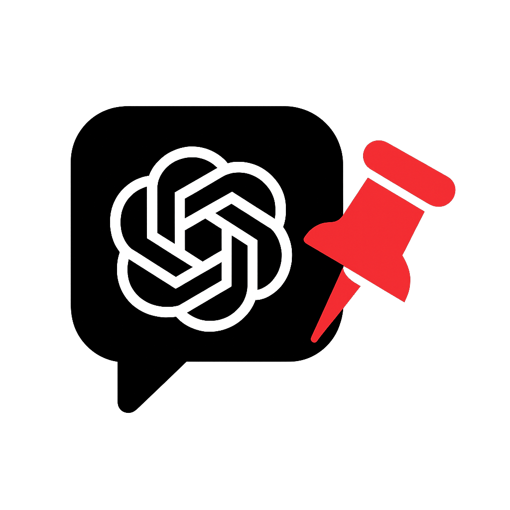

# 📌 PinGPT



**ChatGPT 대화에 스마트한 책갈피 기능을 추가하는 Chrome 확장 프로그램**

---

## 🎯 주요 기능

### 📌 원클릭 책갈피
- ChatGPT 대화 중 중요한 부분에 **한 번의 클릭**으로 책갈피 추가
- 직관적인 📌 버튼으로 즉시 북마크 생성
- 시각적 피드백과 함께 책갈피 상태 표시

### 🚀 빠른 이동 기능
- **최근 책갈피로 빠르게 이동**하는 원클릭 버튼
- 긴 대화에서도 중요한 지점으로 즉시 스크롤
- 🧭 퀵 점프 버튼으로 쉬운 네비게이션

### 🔧 스마트 관리
- **책갈피 이름 변경** 및 개인화
- **즐겨찾기 설정**으로 우선순위 관리
- **스와이프 제스처**로 책갈피 삭제 (모바일 친화적)

### 🌍 다국어 지원
- **5개 언어** 완전 지원: 한국어, 영어, 일본어, 중국어, 스페인어
- ChatGPT 페이지 언어 자동 감지
- 브라우저 언어 설정 연동

### 🎨 현대적 UI/UX
- **그라데이션 디자인**과 부드러운 애니메이션
- 반응형 팝업 UI (동적 높이 조정)
- 직관적인 드래그 스크롤 기능
- 고급 마이크로 인터랙션

---

## 📦 설치 방법

### Chrome 웹 스토어 (권장)
1. [Chrome 웹 스토어] https://chromewebstore.google.com/detail/lofiomkdddodedngbcbcchhcjcpdlanl?utm_source=item-share-cb 방문
2. **"Chrome에 추가"** 클릭

### 개발자 모드 설치
```bash
# 1. 저장소 복제
git clone https://github.com/verystrongdeveloper/PinGPT.git

# 2. Chrome 확장 프로그램 관리 페이지로 이동
# chrome://extensions/

# 3. 개발자 모드 활성화
# 4. "압축해제된 확장 프로그램을 로드합니다" 클릭
# 5. PinGPT 폴더 선택
```

---

## 🎮 사용법

### 기본 사용법
1. **ChatGPT 페이지** ([chat.openai.com](https://chat.openai.com) 또는 [chatgpt.com](https://chatgpt.com))로 이동
2. 대화 중 중요한 메시지에서 **📌 버튼** 클릭
3. 확장 프로그램 아이콘 클릭하여 **책갈피 목록** 확인
4. 책갈피 클릭으로 **해당 위치로 이동**

### 고급 기능
- **책갈피 이름 변경**: 연필 ✏️ 버튼 클릭 후 원하는 이름 입력
- **즐겨찾기 설정**: 별 ⭐ 버튼으로 최근 책갈피 설정
- **빠른 이동**: 🧭 버튼으로 최근 책갈피로 즉시 이동
- **책갈피 삭제**: 모바일에서 좌우 스와이프, 데스크톱에서 드래그

### 키보드 단축키
- `Ctrl + 클릭` (Windows) / `Cmd + 클릭` (Mac): 책갈피 추가/제거
- `Esc`: 팝업 닫기
- `Enter`: 책갈피 이름 변경 확인

---

## 🔧 기술 스택

### 핵심 기술
- **Manifest V3**: 최신 Chrome 확장 프로그램 표준
- **Vanilla JavaScript**: 경량화된 ES6+ 코드
- **Chrome Storage API**: 안전한 데이터 저장
- **Mutation Observer**: 동적 DOM 변화 감지

### 개발 도구
- **Content Scripts**: ChatGPT 페이지 기능 주입
- **Background Scripts**: 확장 프로그램 백그라운드 처리
- **Popup Scripts**: 책갈피 관리 UI
- **CSS3 Animations**: 부드러운 사용자 경험

### 브라우저 지원
- Chrome 88+
- Edge 88+
- Brave Browser
- 기타 Chromium 기반 브라우저

---

## 📁 프로젝트 구조

```
PinGPT/
├── 📄 manifest.json          # 확장 프로그램 설정
├── 📄 content.js            # ChatGPT 페이지 스크립트
├── 📄 content.css           # 콘텐츠 스타일
├── 📄 popup.html            # 팝업 UI 구조
├── 📄 popup.js              # 팝업 로직
├── 🖼️ PinGPT_icon.png       # 메인 아이콘
├── 🖼️ icon_for_publish.png  # 퍼블리싱용 아이콘
└── 📁 shared/
    ├── 📄 constants.js      # 공통 상수
    ├── 📄 constants.mjs     # ES 모듈 상수
    ├── 📄 translations.js   # 번역 텍스트
    └── 📄 translations.mjs  # ES 모듈 번역
```

---

## 🛡️ 보안 및 개인정보

### 데이터 보호
- **로컬 저장소만 사용**: 모든 데이터는 사용자 기기에만 저장
- **외부 서버 미사용**: 개인정보 외부 전송 없음
- **최소 권한 원칙**: 필요한 권한만 요청

### 권한 설명
- `storage`: 책갈피 데이터 로컬 저장
- `activeTab`: 현재 ChatGPT 탭에서만 동작
- `host_permissions`: ChatGPT 도메인에서만 활성화

### 개인정보 처리
- **수집 데이터**: 책갈피 위치 정보만 (대화 내용 수집 안 함)
- **데이터 보존**: 세션 기반 (새로고침 시 초기화)
- **암호화**: Chrome 내장 암호화 사용

---

## 🚀 개발 가이드

### 개발 환경 설정
```bash
# 저장소 복제
git clone https://github.com/your-username/PinGPT.git
cd PinGPT

# 개발용 확장 프로그램 로드
# 1. chrome://extensions/ 접속
# 2. 개발자 모드 활성화
# 3. "압축해제된 확장 프로그램을 로드합니다" 클릭
# 4. PinGPT 폴더 선택
```

### 코드 구조
```javascript
// content.js - 메인 기능
const CONSTANTS = {
  SELECTORS: {
    MARKDOWN: '.markdown',
    PIN_BTN: '.pingpt-btn'
  },
  STORAGE_KEY: 'chatpins'
};

// 책갈피 추가/제거 로직
function handlePinClick(btn, element) {
  // 책갈피 토글 처리
}

// popup.js - UI 관리
function loadPins(pinList, content) {
  // 책갈피 목록 렌더링
}
```

### 빌드 및 배포
```bash
# 1. 코드 압축 (선택사항)
# 2. manifest.json 버전 업데이트
# 3. Chrome 웹 스토어 개발자 대시보드 접속
# 4. 새 버전 업로드
```

---

## 🤝 기여하기

### 버그 신고
1. gnhmoney09042@gmail.com 메일 작성
2. 버그 재현 단계 상세 기록
3. 브라우저 버전 및 환경 정보 포함

### 기능 제안
1. **Feature Request** 템플릿 사용
2. 구체적인 사용 사례 설명
3. 예상되는 UI/UX 변경사항 기술

### 개발 참여
```bash
# 1. 저장소 포크
# 2. 기능 브랜치 생성
git checkout -b feature/new-feature

# 3. 코드 작성 및 테스트
# 4. 커밋 메시지 규칙 준수
git commit -m "feat: 새로운 기능 추가"

# 5. Pull Request 생성
```

### 코딩 규칙
- **ES6+ 문법** 사용
- **JSDoc 주석** 작성
- **일관된 네이밍 컨벤션**
- **모듈화된 코드 구조**

---

## 📊 성능 최적화

### 메모리 사용량
- **경량 설계**: 최소한의 메모리 사용
- **이벤트 리스너 정리**: 메모리 누수 방지
- **DOM 조작 최소화**: 성능 최적화

### 로딩 속도
- **지연 로딩**: 필요할 때만 기능 활성화
- **캐시 활용**: 반복 계산 최소화
- **비동기 처리**: 논블로킹 실행

### 브라우저 호환성
- **폴리필 사용**: 구버전 브라우저 지원
- **기능 감지**: 동적 기능 활성화
- **그레이스풀 디그레이데이션**: 점진적 향상

---

## 🔍 문제 해결

### 일반적인 문제
**Q: 책갈피 버튼이 보이지 않아요**
- A: 페이지 새로고침 후 확장 프로그램 아이콘 확인

**Q: 책갈피가 저장되지 않아요**
- A: Chrome 저장소 권한 확인 및 시크릿 모드 비활성화

**Q: 다국어가 제대로 표시되지 않아요**
- A: 브라우저 언어 설정 확인 후 확장 프로그램 재시작

### 고급 문제 해결
```javascript
// 개발자 도구에서 디버깅
chrome.storage.sync.get(['chatpins'], (data) => {
  console.log('저장된 책갈피:', data.chatpins);
});

// 책갈피 데이터 초기화
chrome.storage.sync.clear(() => {
  console.log('모든 데이터 삭제됨');
});
```

---

## 📈 로드맵

### v1.0 (현재)
- ✅ 기본 책갈피 기능
- ✅ 5개 언어 지원
- ✅ 현대적 UI/UX

### v1.1 (예정)
- 🔄 클라우드 동기화
- 🔄 책갈피 태그 시스템
- 🔄 내보내기/가져오기 기능

### v1.2 (계획)
- 📋 책갈피 검색 기능
- 📋 키보드 단축키 커스터마이징
- 📋 다크 모드 지원

### v2.0 (미래)
- 🎯 AI 기반 자동 책갈피
- 🎯 대화 요약 기능
- 🎯 협업 공유 기능

---

## 📜 라이선스

MIT License

Copyright (c) 2024 PinGPT Team

Permission is hereby granted, free of charge, to any person obtaining a copy
of this software and associated documentation files (the "Software"), to deal
in the Software without restriction, including without limitation the rights
to use, copy, modify, merge, publish, distribute, sublicense, and/or sell
copies of the Software, and to permit persons to whom the Software is
furnished to do so, subject to the following conditions:

The above copyright notice and this permission notice shall be included in all
copies or substantial portions of the Software.

THE SOFTWARE IS PROVIDED "AS IS", WITHOUT WARRANTY OF ANY KIND, EXPRESS OR
IMPLIED, INCLUDING BUT NOT LIMITED TO THE WARRANTIES OF MERCHANTABILITY,
FITNESS FOR A PARTICULAR PURPOSE AND NONINFRINGEMENT. IN NO EVENT SHALL THE
AUTHORS OR COPYRIGHT HOLDERS BE LIABLE FOR ANY CLAIM, DAMAGES OR OTHER
LIABILITY, WHETHER IN AN ACTION OF CONTRACT, TORT OR OTHERWISE, ARISING FROM,
OUT OF OR IN CONNECTION WITH THE SOFTWARE OR THE USE OR OTHER DEALINGS IN THE
SOFTWARE.

---

## 🙏 감사의 말

### 기여자들
- **개발팀**: 혁신적인 아이디어와 뛰어난 구현
- **베타 테스터**: 소중한 피드백과 버그 발견
- **번역가**: 다국어 지원을 위한 정확한 번역

### 오픈소스 라이브러리
- **Chrome Extensions API**: 강력한 확장 프로그램 플랫폼
- **웹 표준**: 현대적인 웹 기술 지원

### 커뮤니티
- **ChatGPT 사용자**: 지속적인 관심과 의견 제시
- **개발자 커뮤니티**: 기술적 조언과 협력

---

## 📞 연락처

### 개발팀
- **이메일**: gnhmoney09042@gmail.com
- **GitHub**: https://github.com/verystrongdeveloper/PinGPT

---

**⭐ 이 프로젝트가 유용하셨다면 Star를 눌러주세요!**

*PinGPT로 더 스마트한 ChatGPT 경험을 시작하세요! 🚀*
